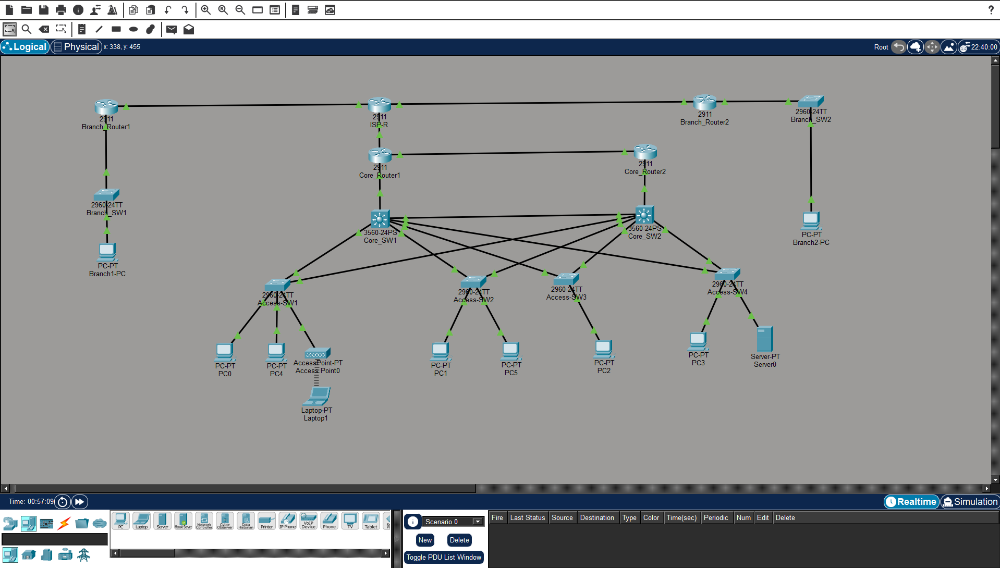

# Enterprise-network-project
Designed and implemented a three-tier enterprise campus network in Cisco Packet Tracer featuring redundant Layer 2 and Layer 3 architecture, centralized network services, wireless integration, and basic security controls. The project was built from scratch to simulate a small enterprise environment while practicing real-world configuration and troubleshooting.

## 📐 Topology

- **Core layer:** 2× Cisco 2911 routers (Core_Router1, Core_Router2)
- **Distribution layer:** 2× Cisco 3560 multilayer switches (Core_SW1, Core_SW2) — dual-homed to core and access layers for redundancy
- **Access layer:** 4× Cisco 2960 switches, one per department
- **Services layer:** Centralized DHCP/DNS server in the Management VLAN
- **Wireless:** Access point + wireless client integrated into the access layer
- **WAN extension:** Simulated ISP router connecting HQ to two branch offices via BGP
- **End devices:** PCs across all departments, plus one wireless laptop

## 🛠️ Technologies implemented

- **VLANs** — departments segmented (HR, IT, Sales, Management)
- **802.1Q trunking** — switch-to-switch links carrying tagged multi-VLAN traffic
- **Rapid PVST+ (Spanning Tree)** — loop prevention on redundant dual-homed links, with explicit root priority tuning
- **Inter-VLAN routing** — via SVIs on multilayer distribution switches
- **HSRP** — gateway redundancy with priority/preempt tuning
- **OSPF (multi-area)** — Area 0 backbone for core links, Area 1 for VLAN subnets; distribution switches acting as ABRs
- **DHCP & DNS** — centralized server providing dynamic addressing and name resolution to every VLAN via DHCP relay
- **Network security (ACL)** — extended ACL enforcing inter-VLAN access restrictions
- **Wireless LAN** — WPA2-PSK secured access point, integrated into the existing VLAN structure
- **SNMP** — read-only community configured for future monitoring integration
- **eBGP** — multi-site routing across four autonomous systems (HQ, ISP, Branch-1, Branch-2)
- **GRE tunneling** — attempted as a precursor to site-to-site VPN over the WAN

## 🗺️ IP addressing plan

| Block | Range | Purpose |
|---|---|---|
| Point-to-point links (LAN) | 192.168.1.0/24 (carved into /30s) | Router-to-switch links |
| VLAN 10 — HR | 10.10.10.0/24 | .1/.2 switch IPs, .254 HSRP VIP |
| VLAN 20 — IT | 10.20.20.0/24 | .1/.2 switch IPs, .254 HSRP VIP |
| VLAN 30 — Sales | 10.30.30.0/24 | .1/.2 switch IPs, .254 HSRP VIP |
| VLAN 40 — Management | 10.40.40.0/24 | .1/.2 switch IPs, .254 HSRP VIP, DHCP/DNS server at .20 |
| WAN links | 203.0.113.0/24 (carved into /30s) | HQ–ISP–Branch point-to-point links |
| Branch-1 LAN | 172.16.1.0/24 | Branch1 router + endpoint |
| Branch-2 LAN | 172.16.2.0/24 | Branch2 router + endpoint |

## 🌐 Services layered onto the campus network

**DHCP & DNS** — A centralized server in the Management VLAN provides dynamic IP addressing and name resolution to every other VLAN. Since DHCP discovery relies on broadcast traffic, which doesn't cross VLAN boundaries, `ip helper-address` (DHCP relay) was configured on the distribution switches to forward these requests to the server.

**Network security (ACL)** — An extended ACL restricts the Sales VLAN from reaching the Management VLAN, where infrastructure services reside, while leaving all other inter-VLAN traffic unaffected. This demonstrates basic network segmentation and least-privilege access control.

**Wireless LAN** — A wireless access point with WPA2-PSK authentication was added to the access layer, allowing wireless clients to join the same VLAN and addressing scheme as wired endpoints — proving the network design extends cleanly to wireless without rework.

**SNMP** — Read-only SNMP community strings were configured on core network devices, laying the groundwork for centralized monitoring tools (e.g., a future Prometheus/Grafana integration).

## 🌍 Multi-site WAN extension (Branch-1 & Branch-2)

To extend this network beyond a single site, a separate WAN topology was built connecting HQ to two simulated branch offices through a simulated ISP router, using BGP for inter-site routing.

### Technologies implemented
- **eBGP peering** — four autonomous systems configured (HQ, ISP, Branch-1, Branch-2), each advertising its own networks
- **WAN addressing** — point-to-point /30 subnets simulating public IP space between sites
- **GRE tunneling** — attempted as a precursor to site-to-site VPN, to demonstrate tunnel-based connectivity over the WAN

### What worked
BGP peering sessions established successfully across all four routers, verified with `show ip bgp summary`. Each router correctly learned and advertised routes to every other site's network, with correct AS-path and next-hop information confirmed via `show ip route bgp`.

### What didn't fully work — and the real debugging behind it

**IP/port mismatch on the ISP-simulation router** — interface IPs were assigned in a different order than the physical cabling, causing two routers to sit in different subnets despite both interfaces showing "up." Diagnosed using `show ip arp` (no ARP entry forming) cross-referenced against `show running-config interface` on both ends of the link. Fixed by re-mapping IPs to match the actual physical topology.

**End-to-end forwarding inconsistency despite correct routing tables** — even after BGP routes propagated correctly in both directions (confirmed clean on every router, with no ACLs or filters present), ping tests between Branch-1, Branch-2, and HQ failed intermittently. ARP, routing tables, and access-lists were all ruled out as causes. The most likely remaining explanation is a RIB/FIB (routing table vs. forwarding table) synchronization quirk specific to Packet Tracer's BGP simulation. This distinction between the **control plane** (BGP successfully exchanging routes) and the **data plane** (actual packet forwarding) is a real, useful concept this debugging surfaced, even though the underlying issue wasn't fully resolved in-simulator.

### IPsec/VPN limitation
A site-to-site IPsec VPN was attempted on top of this WAN topology. Configuration of `crypto isakmp` commands failed with `% Invalid input detected`, traced back to the default router IOS image lacking the `securityk9` crypto feature set. Attempting to enable it via `license boot module ... technology-package securityk9` was also unsupported on the device templates used. This is a Packet Tracer-specific licensing constraint — in a real environment, or with a properly licensed IOS image, this would be resolved before configuring crypto commands.

## 🔧 Real problems hit during the build — and how they were fixed

**1. STP and HSRP were misaligned, causing failed failover**
HSRP correctly elected the standby switch as Active when the primary went down, but PCs still couldn't reach the network. Root cause: STP was independently blocking the path to the new Active switch. Fixed by explicitly setting STP root priority to align Layer 2 forwarding with the Layer 3 HSRP Active switch.

**2. HSRP failover took ~50 seconds instead of ~10**
Diagnosed using `show spanning-tree summary` — the switches were running classic 802.1D STP instead of Rapid PVST+. Fixed by explicitly setting `spanning-tree mode rapid-pvst` on all switches, bringing failover down to a few seconds.

**3. Trunk port mismatch after extending the network**
While adding a new VLAN, a trunk link only showed one VLAN as allowed instead of all of them — traced back to using `switchport trunk allowed vlan X` instead of `switchport trunk allowed vlan add X`, which replaces the entire allowed list rather than adding to it.

**4. DHCP server handing out addresses without a gateway or DNS server**
Despite correctly configured DHCP pools, clients received an IP but no gateway/DNS. Root cause was twofold: the server's own global gateway/DNS settings were blank, and a hidden, non-removable default pool (`serverPool`) with conflicting `0.0.0.0` values was present. Fixed by configuring the server's global network settings and editing the default pool to use non-conflicting values.

**5. Hardware port assumptions caused early rework**
Initial cabling plans assumed Gigabit ports that didn't exist on certain switch models in use. Learned to always verify real port availability with `show ip interface brief` or the Physical tab before finalizing a cabling plan.

## 🔒 Security hardening layer

After completing the base campus network, a comprehensive security hardening 
layer was implemented across all devices and VLANs, covering the following:

### SSH hardening (all devices)
- Disabled Telnet completely — SSH version 2 only on all VTY lines
- RSA 1024-bit key generation tied to hostname + domain identity
- Local username/password authentication (`login local`) on both VTY 
  and console lines
- Idle session timeout set to 5 minutes (`exec-timeout 5 0`)
- All passwords encrypted in running config (`service password-encryption`)
- Legal warning banner on every device (`banner motd`)

### Port security (all access switches)
- Maximum 1 MAC address per access port
- Sticky MAC learning — first device auto-learned and locked in
- Violation mode: shutdown — port enters err-disabled state on 
  unauthorized device detection
- All unused ports (Fa0/4–Fa0/24) administratively shut down to 
  prevent unauthorized physical access

### Dynamic ARP Inspection (DAI)
- Enabled on all switches for all VLANs
- Validates ARP packets against DHCP snooping binding table
- Prevents ARP poisoning and Man-in-the-Middle attacks
- Trusted/untrusted port designation mirrors DHCP snooping config

### Security stack summary

| Feature | Protects Against |
|---|---|
| SSH hardening | Eavesdropping on management traffic |
| Banner | Unauthorized access, legal liability |
| Port security | Rogue devices, MAC flooding |
| Unused port shutdown | Physical unauthorized access |
| DAI | ARP poisoning, Man-in-the-Middle |

## 📁 Files in this repo

- `project1.pkt` — full Packet Tracer file (campus network + WAN extension)
- `topology-screenshot.png` — network diagram
- `configs/` — running-config text exports for every device

## 🎯 What this project demonstrates

- Hands-on configuration of VLANs, trunking, STP, OSPF, and HSRP from scratch
- Centralized network services (DHCP/DNS) with cross-VLAN delivery via relay
- Practical network security implementation using ACLs
- Wireless LAN integration into an existing wired VLAN architecture
- Multi-site routing with eBGP across independently administered network segments
- Real troubleshooting ability — diagnosing and fixing failures, not just following a script
- Clear understanding of the control plane vs. data plane distinction in routing
- Honest awareness of tooling limitations and how they'd be resolved in a real environment
